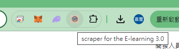
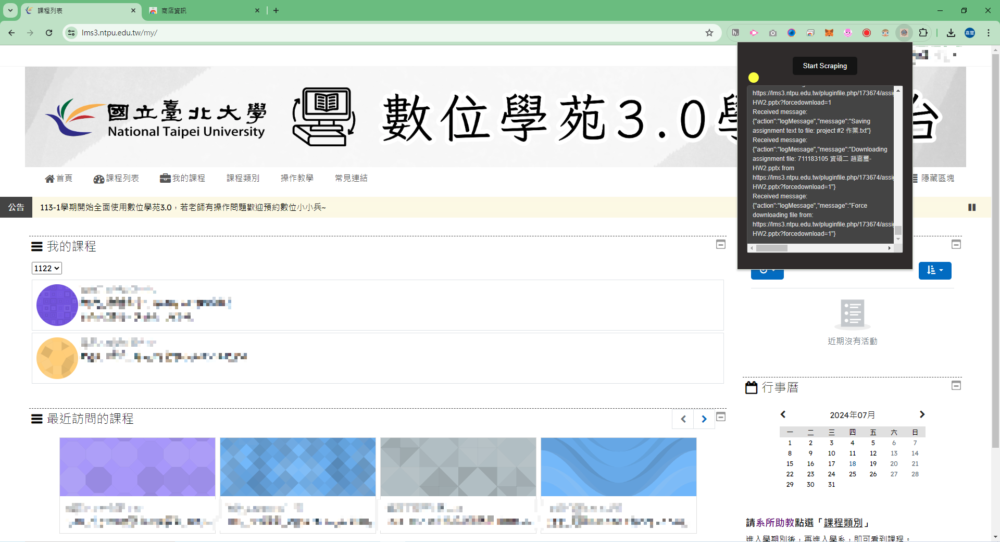

# 數位學苑3.0 檔案爬蟲

這是為臺北大學或任何使用數位學苑3.0的學生設計的Google Extension爬蟲軟體。

## 功能

- 快速下載所有課程檔案和作業檔案
- 自動打包下載成一個.zip檔案

## 使用方法-1

直接到 [這裡](https://chromewebstore.google.com/detail/scraper-for-the-e-learnin/bjhebdgfnaocpigifmelcfnghadimhgg) 安裝Extension。

並且按照 **使用方法-2** 的 4-6 步驟使用

## 使用方法-2

1. clone 此專案：
    ```sh
    git clone https://github.com/nice3310/Elearning_Scraper.git
    ```
    或者下載.zip檔案並手動解壓縮。

2. 開啟Chrome瀏覽器並進入擴充功能頁面：
    ```sh
    chrome://extensions/
    ```

3. 點擊左上角的「載入未封裝項目」，選擇剛剛解壓縮的資料夾。

    

4. 在擴充功能頁面釘選此Extension。

    

5. 登入數位學苑3.0。

6. 點擊「Start Scraping」按鈕，開始自動下載所有檔案。

    

